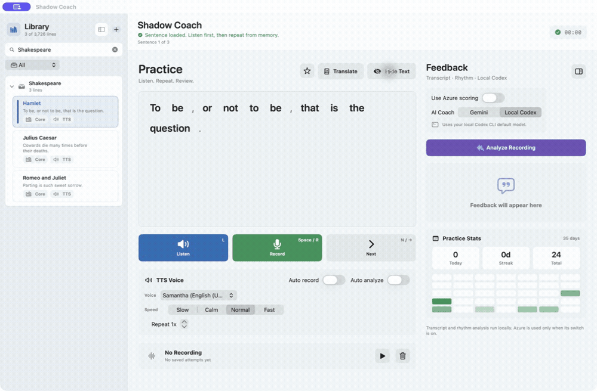

# Shadow Coach

**Turn real English videos into sentence-by-sentence shadowing practice, then see exactly which words, sounds, and rhythms need work.**

[中文说明](README.zh-CN.md) · [Architecture](docs/architecture.md) · [Contributing](CONTRIBUTING.md) · [Privacy](docs/privacy.md)

Shadow Coach is a local-first macOS and iPhone practice app. Listen without seeing the text, repeat from memory, record yourself, and compare your speech with the original. Most library, audio, history, and analysis data stays on your device.



> Status: early open-source preview. macOS is the primary app; iPhone is a companion that imports `.shadowcoachbundle` libraries exported from the Mac.

## Why It Is Different

- **Real voices first.** Import media plus subtitles or supported URLs; TTS is only a fallback.
- **Memory before reading.** Reference text stays hidden while you listen and repeat.
- **Evidence, not a vague score.** Compare transcripts, word timing, pronunciation, phonemes, pauses, pitch, and intensity.
- **Local-first workflow.** Library, recordings, analysis cache, and optional local Codex feedback remain on your Mac.
- **Bring your own providers.** Local analysis works without a paid LLM. Azure, Gemini, and Codex CLI are optional.

## Practice Flow

1. Import a transcript, media with subtitles, or a supported URL.
2. Listen to one sentence with the text hidden.
3. Repeat and record from memory.
4. Analyze when you are ready.
5. Fix the most important word, sound, or rhythm issue and try again.

## Features

### Library and import

- Persistent folders, search, tags, favorites, practiced/new filters, natural number ordering, and source quality labels.
- Import `.txt`, `.csv`, `.xlsx`, `.srt`, and `.vtt` transcripts.
- Import `.mp4`, `.mov`, `.m4a`, or `.mp3` with `.srt`, `.vtt`, or supported spreadsheet subtitles.
- Preview URL metadata before importing from YouTube, TED, or VOA-compatible pages.
- Prefer human subtitles; use local WhisperX or WhisperKit when only automatic captions are available.
- Export selected folders as a `.shadowcoachbundle` for iPhone.

### Practice and feedback

- Play real source clips, with macOS/iOS TTS fallback.
- Hide or reveal text, select phrases for translation, and look up words.
- Record, replay, save, and delete attempts per sentence.
- WhisperX transcript and word-level timing.
- Target-versus-user word diff for missing, extra, and changed words.
- Praat/Parselmouth speaking rate, pauses, pitch, intensity, and emphasis evidence.
- Optional Azure Pronunciation Assessment for word and phoneme scores.
- Optional local Codex CLI or Gemini coaching, cached by recording and provider.
- Daily practice history and progress statistics.

## Install

### For learners

Download the signed and notarized DMG from [GitHub Releases](../../releases) when the first public release is available, drag **Shadow Coach** to Applications, and open it.

The core listen, record, playback, library, TTS, and local history workflow works without cloud API keys. Advanced import and analysis features show actionable setup guidance when an optional dependency is missing.

### For developers

Requirements: macOS 13+, Xcode Command Line Tools, and Homebrew for optional media tools.

```bash
git clone https://github.com/YOUR_ACCOUNT/ShadowCoach.git
cd ShadowCoach
./scripts/bootstrap.sh
swift run ShadowCoach
```

Build the app bundle:

```bash
./scripts/build-app.sh
open "build/Shadow Coach.app"
```

Run checks:

```bash
./scripts/doctor.sh
swift test
```

Open the iPhone companion:

```bash
open ios/ShadowCoachMobile.xcodeproj
```

Set your own development team in Xcode. Personal libraries, recordings, provider credentials, and exported bundles are intentionally excluded from this repository.

## Optional Capabilities

| Capability | Tool/provider | Required? | Data location |
|---|---|---:|---|
| Listen, record, library, TTS | Apple frameworks | Yes | Local |
| URL/media import | `yt-dlp`, `ffmpeg` | No | Local |
| Transcript and word timing | WhisperX or WhisperKit | No | Local |
| Prosody evidence | Praat/Parselmouth | No | Local |
| Pronunciation assessment | Azure Speech | No | Azure |
| Coach explanation | Codex CLI or Gemini | No | Depends on provider |
| Phrase translation | Azure Translator, with fallback | No | Provider |

Run `./scripts/doctor.sh` to see what is available on your machine. See [setup details](docs/setup.md) for optional installation and configuration.

See [Dependency distribution](docs/dependencies.md) for what should be linked, downloaded on demand, installed with Homebrew, or kept optional.

Install the optional local toolchain from official package sources:

```bash
./scripts/install-local-tools.sh --media
./scripts/install-local-tools.sh --analysis
# Or install both groups:
./scripts/install-local-tools.sh --all
```

## Data and Privacy

Runtime data is stored outside the source tree:

```text
~/Library/Application Support/ShadowCoach/
```

Never commit that folder. Never include downloaded videos, subtitles, transcripts, recordings, model weights, or API credentials in an issue. See [Privacy](docs/privacy.md) and [Security](SECURITY.md).

## Project Layout

```text
Sources/ShadowCoach/       macOS application
ios/                      iPhone companion application
scripts/                  build, package, diagnostics, prosody helper
config/                   credential-free configuration examples
Tests/                    repository and core regression tests
docs/                     setup, architecture, privacy, release docs
.github/                  CI and issue templates
```

The current macOS prototype grew quickly in one source file. The incremental module extraction plan is documented in [Architecture](docs/architecture.md); contributions that preserve behavior while improving boundaries are welcome.

## Contributing

Start with [CONTRIBUTING.md](CONTRIBUTING.md), run `./scripts/doctor.sh`, and look for issues labeled `good first issue`. Bug reports should include reproducible steps and redacted logs, never private audio or credentials.

## License

Shadow Coach is licensed under [AGPL-3.0](LICENSE). Third-party tools and services retain their own licenses and terms. See [Third-party notices](THIRD_PARTY_NOTICES.md).
